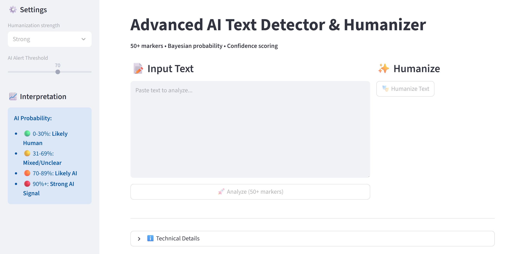

# Advanced AI Text Detector & Humanizer

This Streamlit web application detects AI-generated content in text and humanizes it by rewriting for natural, human-like style. It uses an advanced set of 50+ linguistic, structural, and grammatical markers with Bayesian probability scoring and confidence estimates.

## Features



- Detects over 35 AI-associated words and phrases including formal patterns and repetitive syntax.
- Analyzes sentence burstiness, lexical diversity, passive voice, contractions, and repetition.
- Calculates AI probability with human-readable scoring (0-30% likely human, 70-100% likely AI).
- Shows top contributing AI markers influencing the detection score.
- Humanizes input text using sentence variation, contractions, idiomatic replacements, and natural transitions.
- User-selectable humanization strength: Light, Medium, Strong.
- Real-time before and after AI probability comparison.
- Clean, intuitive UI with detailed marker analysis.

## Installation

```bash
pip install streamlit nltk numpy pandas textstat
```
## Usage

Run the app locally via:

```bash
streamlit run app.py
```

1. Paste or type your text in the input area.
2. Click **Analyze** to get AI detection results with detailed marker breakdown.
3. Use the **Humanize Text** button to rewrite the text to sound more natural.
4. Adjust humanization strength via the sidebar.

## How It Works

The detection module scans the text for AI markers such as overused AI jargon, passive voice, uniform sentence lengths, and low lexical diversity. It calculates a probabilistic AI score with confidence level based on weighted marker contributions.

The humanizer rewrites text by varying sentence lengths, adding conversational contractions, replacing AI-favored words with natural equivalents, and inserting natural-sounding transitions and rhetorical devices.

## Example AI Markers

- Overused words: "delve", "tapestry", "realm", "pivotal"
- Common phrases: "it is important to note", "delve into", "navigating the"
- Structural signs: low burstiness (sentence length variation), high passive voice
- Grammatical points: absence of contractions, formal tone

## AI Text Generation Prompt (Undetectable by Detectors)

Here is the best prompt I've ever seen:
```
You are a skilled human writer with 15+ years experience in content creation. Write [CONTENT_TYPE] about [TOPIC] that reads like natural human writing.

CRITICAL REQUIREMENTS TO AVOID AI DETECTION:

## 1. SENTENCE BURSTINESS (Most Important)
- Mix sentence lengths: 5-word punches → 30-word flows → fragments
- Example structure per paragraph: short. Medium. LONG sentence with clauses—and a fragment!
- Vary openings: "But...", "Look,", "Here's why...", "Truth is..."

## 2. HUMAN VOCABULARY (No AI Tells)
❌ NEVER use: delve, tapestry, realm, embark, pivotal, intricate, testament, catalyst, harness, leverage, vibrant, landscape, comprehensive, seamlessly, resonate, dynamic, optimize, framework, paradigm, notably, arguably, moreover, furthermore, additionally

✅ USE instead:
- Simple: look at, world, key, complex, proof, mix, scene, full, start, huge
- Conversational: stuff, kind of, actually, basically, you know, here's the thing

## 3. CONVERSATIONAL FLOW
- Contractions EVERYWHERE: it's, they're, won't, can't, should've
- Rhetorical questions: "But does it really work?"
- Asides: "if you will," "so to speak," "believe me"
- Fragments: "Complete chaos. Or close enough."

## 4. IMPERFECT PERFECTION
- 1-2 slightly awkward sentences per 300 words
- Minor repetition that feels natural: "This matters. It really matters."
- Emotional tells: frustration ("ridiculous"), excitement ("game-changer!"), skepticism ("maybe")

## 5. STRUCTURE VARIATION
- Paragraphs: 2, 5, 3, 1 sentences (NEVER uniform)
- NO formulaic transitions: skip "firstly/secondly," "in conclusion"
- Natural breaks: "That changes everything."

## 6. SPECIFICITY OVER GENERICITY
- Concrete examples over vague claims
- Numbers with context: "saved us 23%" not "significant savings"
- Personal tone: "I've seen this work firsthand"

## 7. TONE SPECIFICATION
[TONE: conversational/professional/casual/skeptical/enthusiastic]
Audience: [busy professionals/students/general readers]

## 8. LENGTH & PACING
[WORD_COUNT] words. Start punchy, build, end with call-to-action or memorable line.

---

**OUTPUT ONLY THE FINAL TEXT. No explanations.**

[TOPIC/DETAILS HERE]
```

### Quick-Use Templates

#### Blog Post (800 words)

```
Content_type: "engaging blog post"  
Tone: "knowledgeable friend explaining to a colleague"  
Word_count: 800
```

#### Social Media Post (200 words)

```
Content_type: "LinkedIn post/Twitter thread"  
Tone: "excited professional sharing discovery"  
Word_count: 200  
Add 2 rhetorical questions.
```

#### Email Newsletter (500 words)

```
Content_type: "email newsletter"  
Tone: "helpful expert"  
Word_count: 500  
End with specific CTA.
```

#### Product Description (300 words)

```
Content_type: "product description"  
Tone: "enthusiastic but honest"  
Word_count: 300  
Include 2 customer story fragments.
```

## Notes

- This tool is for educational and editorial purposes; detection results are probabilistic, not definitive.
- Complex, heavily human-edited AI text may evade detection.
- Humanized output aims for natural flow and plausibility, not exact content rewriting.


## Acknowledgments


Built with Streamlit, NLTK, Textstat, and inspired by state-of-the-art AI text detection research.

